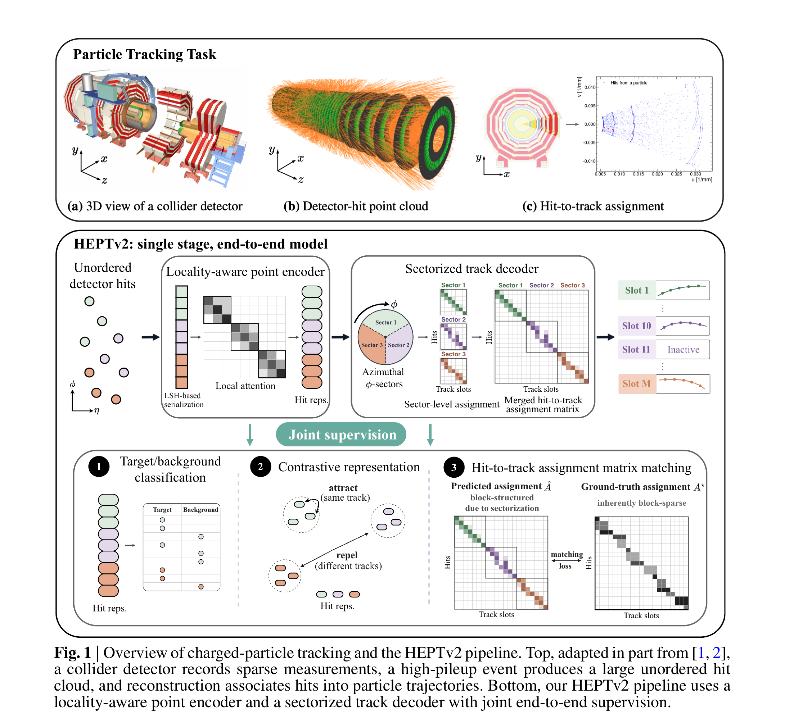

<h1 align="center">HEPTv2: End-to-End Efficient Point Transformer for Charged-Particle Reconstruction</h1>

<p align="center">
    <a href="https://github.com/Graph-COM/HEPTv2"></a>
    <a href="https://github.com/Graph-COM/HEPT"></a>
    <a href="./LICENSE"></a>
</p>

<p align="center">
  Siqi Miao<sup>1†</sup>, Shitij Govil<sup>1†</sup>, Jack P. Rodgers<sup>2</sup>, Mia Liu<sup>2</sup>,
  Javier Duarte<sup>3</sup>, Shih-Chieh Hsu<sup>4</sup>, Yuan-Tang Chou<sup>4*</sup>, Pan Li<sup>1*</sup>
</p>

<p align="center">
  <sup>1</sup>Georgia Institute of Technology &nbsp;·&nbsp;
  <sup>2</sup>Purdue University &nbsp;·&nbsp;
  <sup>3</sup>UC San Diego &nbsp;·&nbsp;
  <sup>4</sup>University of Washington
  <br><sub><sup>†</sup> Equal contribution &nbsp;·&nbsp; <sup>*</sup> Corresponding authors</sub>
</p>

<p align="center"></p>
<p align="center"><em>Figure 1.</em> Overview of charged-particle tracking and the HEPTv2 pipeline. A collider detector records sparse measurements; a high-pileup event produces a large unordered hit cloud, and reconstruction associates hits into particle trajectories. HEPTv2 couples a locality-aware point encoder with a sectorized track decoder under joint end-to-end supervision.</p>

## Introduction

Charged-particle tracking is a core reconstruction task in high-energy physics (HEP), in
which sparse detector hits must be associated into particle trajectories under severe
combinatorial ambiguity. At the High-Luminosity LHC (HL-LHC), this must be done under much
higher pile-up while preserving both tracking quality and computational efficiency.

Existing graph-based approaches achieve strong performance, but their end-to-end runtime is
often dominated by costly graph construction and processing. Prior transformer-based
approaches avoid explicit graph processing, yet still rely on auxiliary stages such as hit
filtering or clustering and are therefore not optimized end-to-end.

**HEPTv2** is a single-stage, end-to-end efficient point transformer for charged-particle
tracking. It couples a **locality-aware point encoder** with a **sectorized track decoder**,
predicting final tracks within an end-to-end trainable pipeline:

- The **encoder** applies locality-sensitive hashing (LSH) directly in detector coordinate
  space `(η, φ)`, serializing the unordered hit cloud into 1D sequences in which spatially
  nearby hits stay close. This preserves tracking-relevant geometric neighborhoods while
  enabling block-wise local attention with cost linear in the number of hits `N`.
- The **decoder** maintains a fixed bank of `M` learnable track slots and predicts the
  hit-to-track assignment matrix directly. To tame ambiguity at full-event scale, it
  partitions the event into `k` broad azimuthal `φ`-sectors and solves `k` smaller
  assignment problems before merging them into the final event-level reconstruction.
- Encoder and decoder are trained **jointly under a unified objective**, so the encoder learns
  trajectory-informed, discriminative per-hit representations and the decoder can directly
  predict hit-to-track assignments end-to-end.

On the TrackML benchmark, HEPTv2 reaches **98.6% double-majority (DM) tracking efficiency**,
with about a **0.8% fake rate**, **~15 ms** inference latency and **0.4 GB** peak memory per
event on a single NVIDIA A100 GPU, both scaling near-linearly to `5 × 10⁵` hits. HEPTv2
attains the best accuracy–latency trade-off among compared methods, improving DM by more than
4.5% over the strongest prior transformer baseline and by 1.1–2.2% over highly optimized
graph-based pipelines, while reducing latency by **7×** and **38–52×** respectively.

## Results on TrackML

| Model           | DM efficiency (ε<sub>pT&gt;0.9</sub>) | Fake rate (f<sub>pT&gt;0.9</sub>) | Latency (ms) | Memory (GB) |
|-----------------|:------:|:---------:|:------------:|:-----------:|
| OC-GNN          | 96.4%  | 0.9%      | 571.5        | 5.4         |
| ACORN-GNN       | 97.5%  | 0.9%      | 783.7        | 16.6        |
| HEPT + DBSCAN   | 89.6%  | 3.3%      | 105.5        | 7.6         |
| Two-stage MF    | 94.1%  | 0.7%      | 99           | –           |
| **HEPTv2**      | **98.6%** | **0.8%** | **15.1**   | **0.4**     |

<sub>Evaluated on the TrackML pixel-detector benchmark under `pT > 0.9 GeV`, `|η| < 4` (Two-stage MF reported under the slightly easier `pT > 1.0 GeV`, `|η| < 4`). All methods measured on a single NVIDIA A100 GPU. See the paper for full kinematic breakdowns, scalability curves, and ablations.</sub>

## Method at a glance

**Locality-aware point encoder.** For each hit, an OR–AND E²LSH ordering value
`o_i = LSH(η_i, φ_i)` is computed directly in detector space. Sorting by `o_i` yields a 1D
sequence that probabilistically preserves `(η, φ)` locality; the sequence is partitioned into
fixed-size blocks and self-attention is restricted within each block, giving a block-diagonal
attention pattern that is linear in `N`. Independent LSH projections are used across heads so
each event is effectively viewed through multiple randomized orderings. Defaults: 4 layers,
8 heads, head dim 128, block size 1024, `m_OR = 3`, `m_AND = 2`.

**Sectorized track decoder.** A fixed bank of `M = 3000` learnable track slots is refined
against the encoded hits via interleaved cross-attention (slot → hits) and self-attention
(slot ↔ slot) over `L = 2` decoder layers. The event is split into `k = 3` azimuthal sectors
(`Δφ = 2π/3`); per sector the decoder predicts a slot-activity vector and a hit-assignment
matrix, which are merged into the event-level reconstruction. This exploits the approximately
block-sparse structure of the ground-truth assignment matrix.

**Joint end-to-end objective.** The model is trained with a weighted sum of encoder-side and
decoder-side losses:

- *Encoder:* InfoNCE contrastive loss over per-hit embeddings + BCE target/background
  classification.
- *Decoder:* Hungarian matching of slots to ground-truth tracks, followed by sigmoid focal
  loss + Dice overlap loss on the matched hit-assignment matrix, plus slot-activity BCE.

Default weights `λ_cls = 0.1`, `λ_assign = 200`, `λ_dice = 2`, `λ_bg = 1.8`, `λ_InfoNCE = 12`;
250 epochs, batch size 1, Muon optimizer, lr `2.5 × 10⁻⁴` with step decay.

## Code

This repository ships a self-contained, minimal implementation of inference and single-GPU
training in [`heptv2/`](./heptv2). It loads a trained checkpoint and runs
`encoder → per-sector decoder → post-processing → tracking metrics`, and supports single-GPU
training (finetune or from scratch) with the same loss composition described above. See
[`heptv2/README.md`](./heptv2/README.md) for full details on supported options and layout.

```
heptv2/
├── run_inference.py      # inference CLI
├── run_train.py          # single-GPU training CLI
├── model/                # Transformer encoder+decoder, HEPT attention, positional emb
├── data/                 # TrackML loader + preprocessing (eta filter, padding, sectors)
├── training/             # train/eval loops, set criterion (Hungarian matcher, dice/focal)
├── eval/                 # post-processing + tracking metrics (DM, fake/dup rate)
├── utils/                # block-size math, E2LSH hashing, serialization
├── configs/              # inference / training YAML configs
└── scripts/              # sbatch launchers + plotting/benchmark scripts
```

## Installation

```bash
conda env create -f environment.yml
conda activate cuda121
```

## Usage

### Inference

```bash
python -m heptv2.run_inference --config heptv2/configs/infer.yaml
```

Set `eval.limit_events: 3` in the config for a quick smoke test, or submit
`sbatch heptv2/scripts/infer.sh` for the full run.

### Training (single GPU)

```bash
python -m heptv2.run_train --config heptv2/configs/train.yaml
```

Per-epoch validation runs the full post-processing + tracking-metrics path, so
`dm` / `technical_efficiency` / `fake_rate` / `dup_rate` are logged alongside the losses.
Checkpoint selection is controlled by `best_metric_key` / `best_metric_mode` (e.g. select by
`dm` with mode `max`). See [`heptv2/README.md`](./heptv2/README.md) for the smoke test and
full-finetune launchers.

## Relation to HEPT (v1)

HEPTv2 builds on the LSH-based serialization idea of [HEPT (ICML 2024)](https://github.com/Graph-COM/HEPT),
but applies it directly in detector coordinate space rather than in latent space, and replaces
the post-hoc DBSCAN clustering stage with a directly-trained sectorized track decoder, yielding
a single end-to-end pipeline.

## Citation

If you find this work useful, please cite:

```bibtex
@article{miao2026heptv2,
  title   = {HEPTv2: End-to-End Efficient Point Transformer for Charged Particle Reconstruction},
  author  = {Miao, Siqi and Govil, Shitij and Rodgers, Jack P. and Liu, Mia and
             Duarte, Javier and Hsu, Shih-Chieh and Chou, Yuan-Tang and Li, Pan},
  year    = {2026}
}
```

## License

This project is released under the [MIT License](./LICENSE).
